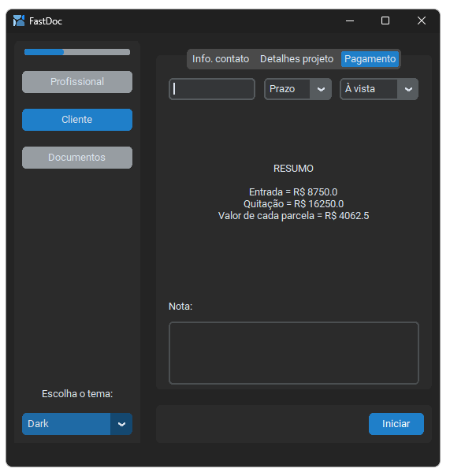

# FastDoc - Aplicativo de Preenchimento Automático de Documentos

_Ferramenta eficiente para arquitetos e engenheiros que agiliza o fluxo de trabalho e reduz erros. Possui interface moderna e intuitiva._

## Características Principais

- **Preenchimento Automático**: O FastDoc elimina a necessidade de inserir repetidamente as mesmas informações em diferentes documentos. Com uma única inserção de dados, o software popula automaticamente diversos tipos de documentos.
  
- **Organização Eficiente**: Após a geração dos documentos, o FastDoc os organiza automaticamente em pastas com o nome de cada cliente, facilitando a gestão e o acesso rápido.

- **Suporte a Diferentes Formatos**: O aplicativo oferece suporte para a geração de documentos em formatos PDF e DOCX, garantindo flexibilidade na escolha do formato preferencial.

- **Licença MIT**: O FastDoc é disponibilizado como um projeto de código aberto sob a licença MIT, incentivando a colaboração e o aprimoramento contínuo por parte da comunidade.


### Status do Projeto

O FastDoc está atualmente **em fase de desenvolvimento** e encontra-se cerca de *90% completo*. Pretendo, futuramente, finalizar os últimos detalhes e aprimorar a experiência geral do usuário.

Se você tiver alguma dúvida, feedback ou sugestão, sinta-se à vontade para entrar em contato comigo.


### GIF Demonstrativo
 

### Capturas de Tela
##### ❇ Profissional (2 abas)

| Pessoa Física                                              | Pessoa Jurídica                                                           |
|---------------------------------------------------------------------------|---------------------------------------------------------------------------|
|  |  |

##### ❇ Cliente (3 abas)

| Info. contato                                                             | Detalhes projeto                                                          | Pagamento                                                                 |
|---------------------------------------------------------------------------|---------------------------------------------------------------------------|---------------------------------------------------------------------------|
|  |  |  |

##### ❇ Documentos (1 aba)

| Lista de documentos                                                    |
|------------------------------------------------------------------------|
|  |

##### ❇ Light Mode

| Em todas as abas                                                     |
|----------------------------------------------------------------------|
|  |

##### ❇ Tela de login

| E-mail, Senha e Lembrar Login                            |
|----------------------------------------------------------|
|  |


## Instalação e Uso

Siga as instruções abaixo para clonar, instalar e começar a usar o FastDoc:

1. Clone o repositório para sua máquina local:
   ```
   git clone https://github.com/seu-usuario/fastdoc.git
   ```

2. Navegue até o diretório do projeto:
   ```
   cd fastdoc
   ```

3. Instale os requerimentos:
   ```
   pip install -r requirements.txt
   ```

4. Execute o aplicativo:
   ```
   python main.py
   ```

## Contribuições

Contribuições são bem-vindas! Se você deseja melhorar este projeto, siga os passos abaixo:

1. Faça um fork do repositório.
2. Crie um novo branch para a sua funcionalidade (`git checkout -b feature/nova-funcionalidade`).
3. Faça as alterações necessárias e teste-as.
4. Faça o commit das suas alterações (`git commit -m 'Adicionada nova funcionalidade'`).
5. Envie para o seu repositório fork (`git push origin feature/nova-funcionalidade`).
6. Abra um Pull Request no repositório original.

## Licença

Distribuído sob a licença MIT. Veja `LICENSE` para mais informações.


## Nota
Espero que o "FastDoc" seja útil em seu próximo projeto.

---

Feito com um bule de ☕ por [Gustavo Rosas](https://github.com/GustavoRosas-Dev).
